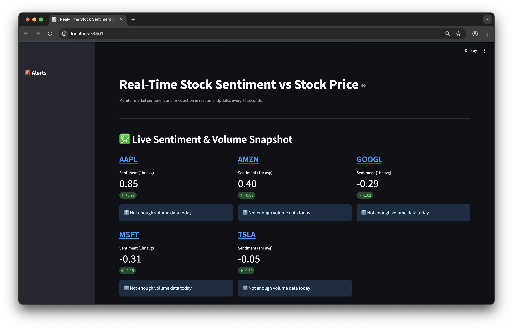
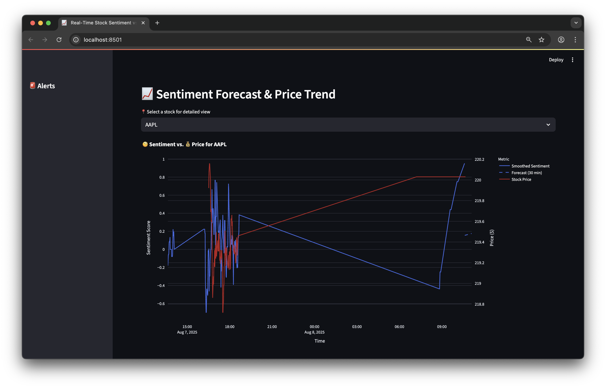
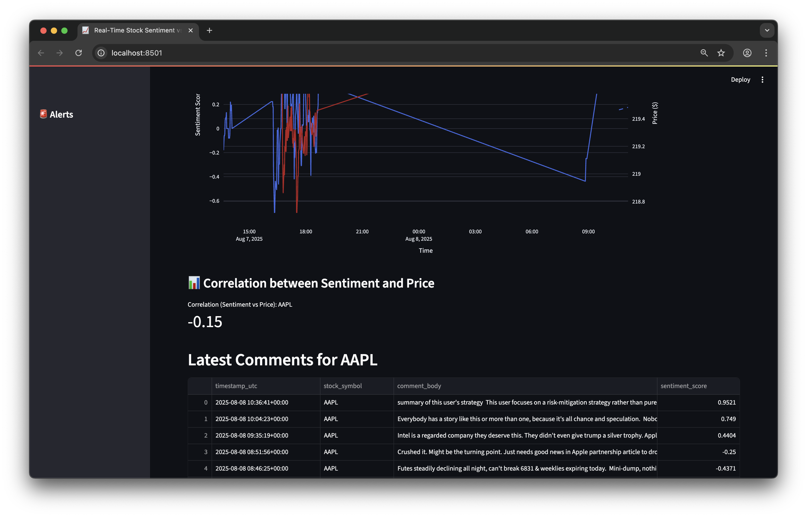
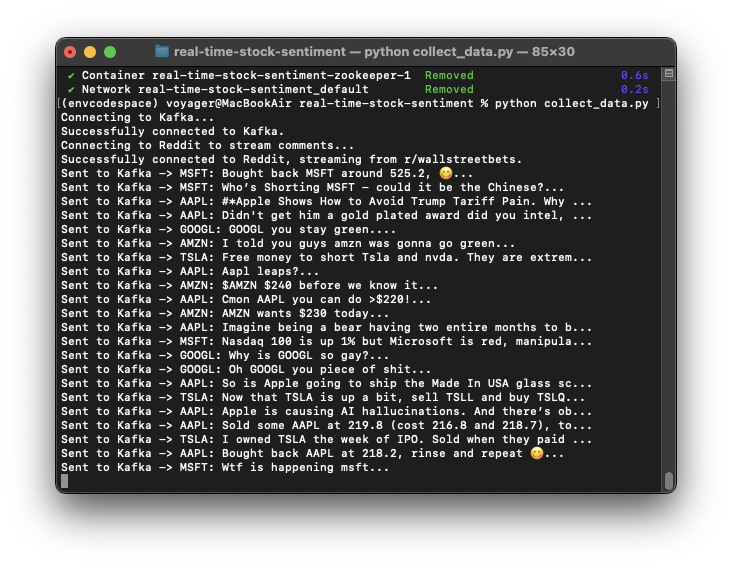

# Real-Time Stock Sentiment Analysis with Spark and Kafka

This project has a complete, end to end data engineering pipeline and performs real time sentiment analysis on social media comments specifically reddit commetns about stocks. It processes the data using Apache Spark and visualise the results on a live dashboard that correlates sentiment with actual stock price data. 


## Final Product 

The final product is a dashboard built with Streamlit. It provides an at-a-glance snapshot of market sentiment, including trends, volume spikes, and short-term forecasts.

### Key Features:
- **Live Sentiment KPIs** 
- **Comment Volume Spike Alerts** 
- **Sentiment Forecasting (linear regression)** 
- **Stock Price correlation with Sentiment:** 





---

## System Architecture


1.  **Data Producers:** Two separate Python scripts run continuously:
    * **Sentiment Producer:** Streams new comments from the Reddit API.
    * **Price Producer:** Fetches the latest stock prices from the Finnhub API every minute.
2.  **Message Broker:** The sentiment producer sends raw comments to an **Apache Kafka** topic, which acts as a durable, real-time message buffer.
3.  **Stream Processor:** An **Apache Spark** Structured Streaming job consumes the data from Kafka, performs cleaning and sentiment analysis, and writes the enriched data to a central database.
4.  **Database:** A **SQLite** database stores the time-series data for both sentiment scores and stock prices.
5.  **Dashboard:** A **Streamlit** web application queries the database and presents the data on an auto-refreshing, interactive dashboard.

---

## Live Pipeline in Action


| Producer (Sending to Kafka) | Consumer (Spark Processing) | Price Fetcher |
| :---: | :---: | :---: |
|  |  |  |

---

## Technology Stack

- **Data Processing:** Apache Spark (Structured Streaming)
- **Messaging:** Apache Kafka, Zookeeper
- **Services & Orchestration:** Docker, Docker Compose
- **Dashboard:** Streamlit, Plotly
- **Data Collection:** Python (`praw`, `finnhub-python`, `schedule`)
- **Sentiment Analysis:** VADER
- **Forecasting:** Scikit-learn, Pandas
- **Configuration:** Python-dotenv

---

##  How to Run

1.  **Clone the repository:**
    ```bash
    git clone [https://github.com/ajeem-codespace/real-time-stock-sentiment.git)
    cd your-repository-name
    ```
2.  **Set up the environment:**
    ```bash
    # Create a Conda environment
    conda create --name sentiment-env python=3.9
    conda activate sentiment-env

    # Install dependencies
    pip install -r requirements.txt
    ```
3.  **Create `.env` file for API Keys:**
    - Create a file named `.env` in the project root.
    - Add your secret keys to this file. It will be ignored by Git.
    
    ```
    REDDIT_CLIENT_ID="YOUR_CLIENT_ID_HERE"
    REDDIT_CLIENT_SECRET="YOUR_CLIENT_SECRET_HERE"
    REDDIT_USER_AGENT="StockSentimentScraper/0.0.1 by u/YourUsername"
    FINNHUB_API_KEY="YOUR_FINNHUB_API_KEY_HERE"
    ```

4.  **Launch the Backend Pipeline:**
    - Start Kafka: `docker-compose up -d`
    - In a new terminal, start the sentiment producer: `python collect_data.py`
    - In a new terminal, start the Spark consumer: `spark-submit --driver-memory 1g --packages org.apache.spark:spark-sql-kafka-0-10_2.12:3.3.1 stream_process_data_db.py`
    - In a new terminal, start the price fetcher: `python price_fetcher.py`

5.  **View the Dashboard:**
    - In a new terminal, run:
    ```bash
    streamlit run dashboard.py
    ```


### Note:  Running the Batch MVP (Initial Version)
These scripts were part of the initial proof-of-concept.

1.  **Collect a Sample Dataset:** `python collect_data_batch.py` (This creates `reddit_comments.csv`)
2.  **Run the Batch Job:** `spark-submit stream_process_data.py` (This processes the CSV and shows results in the console)
