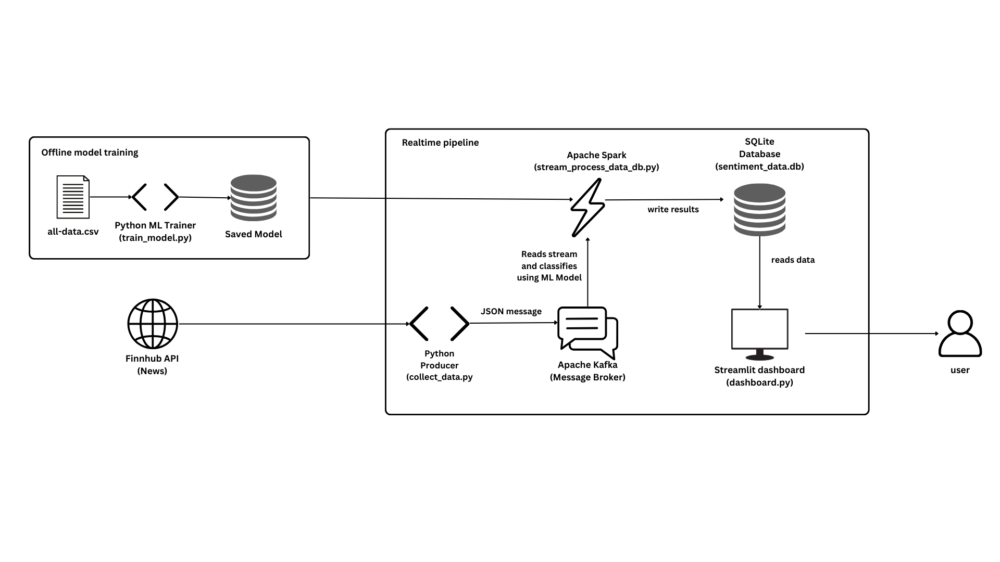
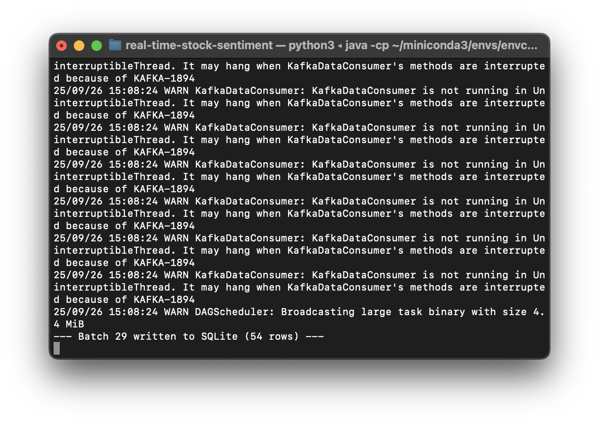

# Real-Time Stock News Sentiment Analysis with PySpark ML

This project is a complete, end-to-end data engineering pipeline that fetches real-time stock news, classifies headlines as **Positive** or **Negative** using a **PySpark ML pipeline**, and visualizes the results on an interactive dashboard.

---

## 📊 Dashboard & Features

The final product is a live dashboard built with Streamlit. It provides an at-a-glance snapshot of market sentiment for specific stocks, powered by a machine learning model.

### Key Features:
- **Live Sentiment KPIs:** Displays the percentage of positive vs. negative news for each stock over the last hour.
- **Headline Volume Alerts:** Programmatically detects and flags unusual spikes in news volume for a stock.
- **PySpark ML Classification:** Uses a trained Logistic Regression model to classify news sentiment in real-time.
- **Interactive Time-Series Analysis:** Allows users to select a stock and visualize the volume of positive and negative news over time.


---

## 🏛️ System Architecture

The project is built on a modern, real-time data streaming architecture where an offline-trained ML model is used for live inference.



1.  **Model Training (Offline):** A PySpark ML `Pipeline` is trained on a labeled dataset of financial news headlines (`all-data.csv`). The trained model, which includes feature extraction and a Logistic Regression classifier, is saved to disk.
2.  **Data Producer:** A Python script fetches the latest stock news from the **Finnhub API** and sends the articles as JSON messages to an **Apache Kafka** topic.
3.  **Stream Processor:** An **Apache Spark** Structured Streaming job consumes the news from Kafka. It **loads the pre-trained ML model** to classify the sentiment of each headline in real-time and writes the results to a database.
4.  **Database:** A **SQLite** database stores the time-series data, including the headline, its predicted sentiment, and the stock symbol.
5.  **Dashboard:** A **Streamlit** web application queries the database to display live metrics, KPIs, and visualizations.

---

## ⚙️ Live Pipeline in Action

The entire backend pipeline runs in separate, coordinated processes.

| Producer (Sending to Kafka) | Consumer (Spark Processing) |
| :---: | :---: |
|  |  |

---

## 🛠️ Technology Stack

- **Data Processing:** Apache Spark (Structured Streaming), PySpark ML
- **Messaging:** Apache Kafka, Zookeeper
- **Services & Orchestration:** Docker, Docker Compose
- **Dashboard:** Streamlit, Plotly
- **Data Collection:** Python (`finnhub-python`)
- **Database:** SQLite
- **Configuration:** Python-dotenv

---

## 🔧 How to Run

1.  **Clone the repository:**
    ```bash
    git clone [https://github.com/your-username/your-repository-name.git](https://github.com/your-username/your-repository-name.git)
    cd your-repository-name
    ```
2.  **Set up the environment:**
    ```bash
    # Create a Conda environment
    conda create --name sentiment-env python=3.9
    conda activate sentiment-env

    # Install dependencies
    pip install -r requirements.txt
    ```
3.  **Create `.env` file for API Keys:**
    - Create a file named `.env` in the project root.
    - Add your secret Finnhub API key.
    ```
    FINNHUB_API_KEY="YOUR_FINNHUB_API_KEY_HERE"
    ```

4.  **Train the ML Model:**
    - This is a one-time step to create the `sentiment_model` folder.
    ```bash
    spark-submit train_model.py
    ```

5.  **Launch the Backend Pipeline:**
    - Start Kafka: `docker-compose up -d`
    - In a new terminal, start the sentiment producer: `python collect_data.py`
    - In a new terminal, start the Spark consumer. This command includes the necessary packages for Kafka and SQLite:
    ```bash
    spark-submit --packages org.apache.spark:spark-sql-kafka-0-10_2.12:3.3.1,org.xerial:sqlite-jdbc:3.34.0 stream_process_data_db.py
    ```

6.  **View the Dashboard:**
    - In a new terminal, run:
    ```bash
    streamlit run dashboard.py
    ```